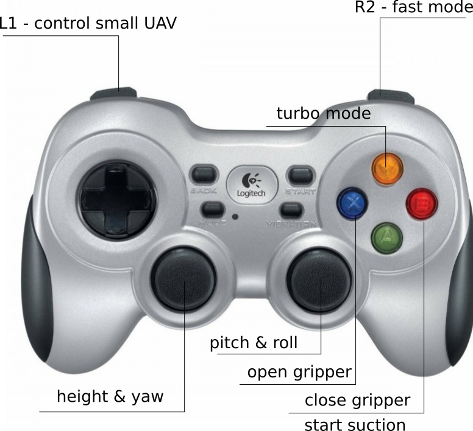

## Aerial manipulation MBZIRC 2022 repo

ROS2 aerial manipulation MBZIRC 2022 repo. 

### Launch commands: 

Send `cmd_vel` command to `UAV`: 

```
ros2 topic pub /am_L/cmd_vel geometry_msgs/msg/Twist '{linear: {x: 0.0,y: 0.01, z: 0.01}, angular: {x: 0.0, y: 0.0, z: 0.0}}'
```

### Run uav_joy_ctl node

Run `uav_joy_ctl` node with following command: 
```
ros2 run mbzirc_aerial_manipulation uav_joy_ctl
```

### Use teleop twist key: 

Use existing `teleop-twist-keyboard` package to send messages to `cmd_vel` topic. 

Run `teleop-twist-keyboard` with: 
```
ros2 run teleop_twist_keyboard teleop_twist_keyboard
```


### Docs: 

Official mbzirc [github repo](https://github.com/osrf/mbzirc)

Official mbzirc [wiki](https://github.com/osrf/mbzirc/wiki)

ROS2 [wiki](https://docs.ros.org/en/foxy/index.html)

Book about [ROS2](https://osrf.github.io/ros2multirobotbook/)

TurtleSim class as a good reference for [dev](https://github.com/ros/ros_tutorials/blob/galactic-devel/turtlesim/src/turtle.cpp) 

### How to control UAV: 



### Battery stuff: 

Use parameter `flightTime` to increase battery life!

### Plugins that are used and that cause trouble 

Plugins that causes trouble during some development is game development plugin. 

### Temp: 

PCL build: https://pcl.readthedocs.io/projects/tutorials/en/latest/compiling_pcl_posix.html  

VTK build: https://github.com/Kitware/VTK/blob/master/Documentation/dev/build.md#linux-getting-started

### Simulation models

Simulation models that can be use can be found [here](https://app.gazebosim.org/OpenRobotics/fuel/collections/mbzirc). 

### Gazebo + Docker + SSH 

How to run `ign_gazebo` GUI with docker and OpenGL support can be found [here](https://github.com/gbalke/docker-ros2-opengl)

### Resources

[ign-tutorials](https://github.com/Blast545/ign_tutorials)

### Current status

Managed to lift blue case with big UAV. However, it's doubtful that controllers don't work as planned. 

Short term plan is to enable odometry to be able to test controllers during tuning. 
After we make sure that controllers are tuned correctly, try to lift objects, and 
check with other teams how is the status of positional control. 

It's not able to use odometry plugin (`pose_static` topic is used for localization). 


Parts of the system that need to be addressed. 
- control --> PIDs added, yaw fix 
- state machine --> SMACC2 can be used
- perception 
- relative localization
- UAV cooperation 

### Odometry

Odometry plugin fails to load with following msg: 
```
[ign gazebo-1] [Err] [OdometryPublisher.cc:132] OdometryPublisher system plugin should be attached to a model entity. Failed to initialize.
```

Source code for odometry publisher can be found [here](https://github.com/gazebosim/gz-sim/blob/ign-gazebo6/src/systems/odometry_publisher/OdometryPublisher.cc)

### Namespace 

Run node with custom namespace with cli with following command: 
```
ros2 run mbzirc_aerial_manipulation uav_joy_ctl --ros-args -r __ns:=<wanted_namespace>
``` 

### PID controller 

Currently used PID controller can be found [here]. 

### Clean build issues 

If you want to build this package, there could be some issues 
regarding custom services. In order to mitigate those issues, please comment out all
lines in `CMakeLists.txt` that take in consideration `uav_joy` as well as 
```
find_package(mbzirc_aerial_manipulation REQUIRED) 
```
. 

After that, run: 
```
colcon build --merge-install
source <workspace>/install/setup.bash
```

Uncomment stuff regarding `uav_joy`. 
Run build again. 

### Joystick debugging 

If joystick doesn't work, check this [info](https://answers.ros.org/question/384456/ros2-joy_node-debugging/). 

In ROS2 joystick is fetched from `/dev/input/eventX`. 
To enable `/dev/input/eventX` run: 
```
sudo chmod a+rw /dev/input/event*
```


### TODO: 

- [x] *Add method for joystick control (reference generation) --> create separate node for joy control*  
- [x] *Add namespaceing to enable easier UAV ctl --> on node level*
- [x] Fetching pose static 
- [x] Added height control 
- [x] Add clients to joy control
- [x] Add horizontal control
- [x] Add and try [simple state machine](https://github.com/fzoric8/sm_aerial_manipulator)  
- [ ] Add yaw control   
- [ ] Figure out states for UAV
- [ ] Think of relative vs. global position control --> changing frame of reference 
- [ ] Check suction mechanism 
- [ ] Tune controllers 
- [ ] Enable development on server 

